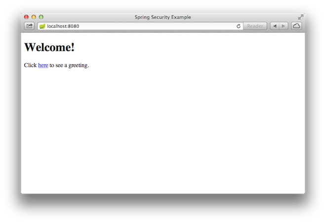

:spring_version: current
:spring_boot_version: 1.5.6.RELEASE
:DispatcherServlet: http://docs.spring.io/spring/docs/{spring_version}/javadoc-api/org/springframework/web/servlet/DispatcherServlet.html
:SpringApplication: http://docs.spring.io/spring-boot/docs/{spring_boot_version}/api/org/springframework/boot/SpringApplication.html
:SpringBootSecurity: http://docs.spring.io/spring-boot/docs/{spring_boot_version}/reference/htmlsingle/#boot-features-security
:toc:
:icons: font
:source-highlighter: prettify
:project_id: gs-securing-web
本指南将向您介绍创建由Spring Security保护的资源的简单Web应用程序的过程。

== 你将做出什么

您将构建一个Spring MVC应用程序，它用一个固定用户列表支持的登录表单来保证页面的安全性。

== 你需要什么

:java_version: 1.8
include::https://raw.githubusercontent.com/webGoBetter/getting-started-macros/master/prereq_editor_jdk_buildtools.adoc[]

include::https://raw.githubusercontent.com/webGoBetter/getting-started-macros/master/how_to_complete_this_guide.adoc[]

include::https://raw.githubusercontent.com/webGoBetter/getting-started-macros/master/hide-show-gradle.adoc[]

include::https://raw.githubusercontent.com/webGoBetter/getting-started-macros/master/hide-show-maven.adoc[]

include::https://raw.githubusercontent.com/webGoBetter/getting-started-macros/master/hide-show-sts.adoc[]

== 创建一个不安全的Web应用

在你可以尝试将安全性应用于Web应用之前，你需要一个用于保护的Web应用程序。本节中的步骤指导您完成创建一个非常简单的Web应用程序。然后你将在下一节使用Spring Security将其保护起来。

这个web应用程序包括两个简单的视图，一个是主页，一个是 "Hello World" 页。主页的视图由下面这个Thymeleaf模板来定义：

`src/main/resources/templates/home.html`
[source,html]
----
include::initial/src/main/resources/templates/home.html[]
----

如你所见，这个简单的视图包括一个指向 "/hello" 页面的链接，它由下面这个 Thymeleaf 模板来定义：

`src/main/resources/templates/hello.html`
[source,html]
----
include::initial/src/main/resources/templates/hello.html[]
----

Web应用程序基于Spring MVC。因此，您需要配置Spring MVC并设置视图控制器来公开这些模板。这里有一个配置类，用于在应用程序中配置Spring MVC。

`src/main/java/hello/MvcConfig.java`
[source,java]
----
include::initial/src/main/java/hello/MvcConfig.java[]
----

`addViewControllers()` 方法（覆盖了 `WebMvcConfigurerAdapter` 的同名方法）添加了四个视图控制器。其中两个视图控制器指向了 "home" 视图（在 `home.html` 中定义），另一个指向了 "hello" 视图（在 `hello.html` 中定义）。第四个视图控制器指向另一个视图 "login" ，你将会在下个章节创建这个视图。

此刻，你可以直接跳到 _<<run_the_app>>_  的部分，在不需要任何登陆工作的情况下运行Web应用。

一旦最基本的Web应用创建好了，你可以给他加上安全防护。

[[initial]]
== 建立Spring Security

假设您希望防止未经授权的用户在 "/hello" 上查看问候页。现在，如果用户点击主页上的链接，他们会看到没有任何阻挡的问候语。您需要添加一个屏障，强制用户在看到该页之前登录。

你可以通过配置Spring Security来完成上面所说的事。如果Spring Security在classpath中，SpringBoot {SpringBootSecurity}[自动保护所有HTTP端点] 启动 "basic" 认证，你也可以进一步的定制安全设置。首先要做的事情就是把Spring Security加入到classpath中。

如果使用Gradle，它将会是dependencies部分中的一行：

`build.gradle`
[source,java]
----
dependencies {
    ...
include::complete/build.gradle[tag=security]
    ...
}
----

如果使用Maven，那这将是一个额外的条目添加到 `<dependencies>`:

`pom.xml`
[source,zml]
----
<dependencies>
    ...
include::complete/pom.xml[tag=security]
    ...
</dependencies>
----

这里有一个安全配置，确保只有经过身份验证的用户才能看到秘密问候：

`src/main/java/hello/WebSecurityConfig.java`
[source,java]
----
include::complete/src/main/java/hello/WebSecurityConfig.java[]
----

这个WebSecurityConfig类被 `@EnableWebSecurity` 标注，来启用Spring Security的web安全支持、以及提供与Spring MVC的融合。这个类还继承了`WebSecurityConfigurerAdapter` 并重写了一些方法来指定一些特定的Web安全设置。

`configure(HttpSecurity)` 方法规定了哪个URL应该被保护，哪个不应该。具体而言， "/" 和 "/home" 的路径被配置为不需要任何认证。所有其他URL必须进行身份验证。

当用户成功登录后，他们将被重定向到先前请求的需要身份验证的页面。还有一个自定义（由 `loginPage()` 指定）的 "/login" 页面，每个用户都可以查看。

至于 `configureglobal(AuthenticationManagerBuilder)` 方法，建立了一个内存用户存储与单个用户。该用户被赋予用户名 "user" 、密码 "password" 和角色 "USER" 。

现在，我们需要创建登录页面。目前已经为 "login" 视图赋予了视图控制器，所以你只需要创建login视图本身：

`src/main/resources/templates/login.html`
[source,html]
----
include::complete/src/main/resources/templates/login.html[]
----

正如你所看到的，这个Thymeleaf模板只是给出了一个采集用户名和密码，并将它们作为请求post到 "/login" 的表单。正如刚刚配置的，Spring Security提供一个过滤器，截取该请求，并验证用户身份。如果用户身份验证失败，页面被重定向到 "/login?error" ，我们的页面将显示相应的错误信息。一旦成功登出了，我们的应用程序重定向到到 "/login?logout" 并显示相应的登陆成功的消息。

最后，我们需要给用户提供一种方式来显示当前用户名和Sign Out按钮。更新 `hello.html` 来问候当前用户，并包含一个 "Sign Out" 的按钮，如下所示：

`src/main/resources/templates/hello.html`
[source,html]
----
include::complete/src/main/resources/templates/hello.html[]
----

我们通过使用Spring Security所集成的 `HttpServletRequest#getRemoteUser()` 来显示用户名。该 "Sign Out" 按钮提交一个POST请求给 "/logout" 。一旦成功退出，将用户重定向到 "/login?logout" 

[[run_the_app]]
== 让Web应用可执行

虽然可以将此服务打包为一个传统的 link:/understanding/WAR[WAR] 文件用于部署到外部应用服务器，更为简单的方法是创建了一个独立的应用程序。通过一个 good old Java `main()`方法，你能将一切打包成为一个单一的克执行 JAR 文件。在这一过程中，您使用Spring的提供的 link:/understanding/Tomcat[Tomcat]  servlet容器作为HTTP运行时，而不是将它部署的到一个外部实例在中。

`src/main/java/hello/Application.java`
[source,java]
----
include::complete/src/main/java/hello/Application.java[]
----

include::https://raw.githubusercontent.com/webGoBetter/getting-started-macros/master/spring-boot-application.adoc[]

include::https://raw.githubusercontent.com/webGoBettergetting-started-macros/master/build_an_executable_jar_subhead.adoc[]
include::https://raw.githubusercontent.com/webGoBetter/getting-started-macros/master/build_an_executable_jar_with_both.adoc[]

[[run]]

....
... app starts up ...
....

一旦应用程序启动，用浏览器访问 http://localhost:8080 。你应该看到主页：

当你点击这个链接，它会尝试把你带到 `/hello` 所指向的欢迎页，但因为这个页面是受保护的，而且目前为止你没有登录，它会带你到登陆页：

image::images/login.png[The login page]

NOTE: 如果你跳到这里的不安全的版本，那么你就看不到这个登录页面请随意备份并编写其余的基于安全性的代码。

在登录页面上，分别输入用户名和密码字段的 "user" 和 "password" 作为测试用户登录。一旦您提交登录表单，您将被认证，然后被带到问候页面：

image::images/greeting.png[The secured greeting page]

如果单击 "Sign Out" 按钮，您的身份验证将被撤销，并返回到登录页面，该消息显示您已登出。

== 总结
恭喜你，你已经开发了一个简单的、使用Spring Security来保护的Web应用。

include::https://raw.githubusercontent.com/webGoBetter/getting-started-macros/master/footer.adoc[]

